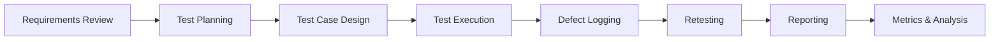

# SQL Testing Portfolio — Elena Kharchenko

QA portfolio demonstrating practical testing skills including SQL validation, API testing, data integrity verification, and defect reporting.

----
## How to Review This Portfolio

If you are reviewing this portfolio as a recruiter or hiring manager, here is the recommended order:

1. Review test cases → [Test Cases](bug-reports/test-cases/)
2. Check SQL validation scenarios → [SQL Scenarios](sql-test-scenarios.md)
3. Review test strategy → [Test Strategy](test-strategy.md)
4. Review execution results → [Test Summary](test-summary-report.md)
5. Review sample bug report → [Bug Report Example](sample-bug-report.md)

This structure reflects real QA workflow:
Test Design → Execution → Defect Logging → Reporting → Metrics


---

## Skills Demonstrated

- Manual Testing
- SQL Testing
- API Testing (Postman)
- Test Case Design
- Bug Reporting
- Data Validation
- Edge Case Testing
- Test Strategy Creation
- Test Execution Reporting

- ## QA Testing Workflow



---

## Project Structure

```text
sql-testing-portfolio
│
├── bug-reports
│   ├── test-cases
│   │   ├── login-tests.md
│   │   ├── payment-test.md
│   │   └── api-negative-tests.md
│   │
│   ├── advanced-sql-tests.md
│   └── sample-bug-report.md
│
├── sql-test-scenarios.md
├── test-data-validation.md
├── test-strategy.md
└── test-summary-report.md
```

---

## Testing Types Covered

- Functional testing
- Negative testing
- Boundary testing
- Database testing
- API testing
- Validation testing

## Test Environment

| Component | Value |
|--------|------|
| OS | Windows 11 |
| Database | MySQL |
| API Tool | Postman |
| Version Control | Git + GitHub |
| Testing Type | Manual + SQL + API |


---

## Tools Used

- SQL
- Postman
- GitHub
- Browser DevTools

---

## Example Defects Found

| ID | Severity | Description |
|----|---------|-------------|
| BUG-001 | High | Login bypass with SQL injection |
| BUG-002 | Medium | Payment accepted with expired card |

## Portfolio Test Modules

This repository contains real-world style QA documentation examples:

• Login Testing — functional validation scenarios  
• Payment Testing — positive and negative test cases  
• SQL Validation — database integrity checks  
• Edge Case Testing — boundary and negative scenarios  
• API Testing — request/response validation  
• Test Strategy — full test planning example  
• Test Metrics — execution analytics sample  
• Bug Report — professional defect report example  

Each module reflectsreal QA workflows including planning, execution, validation, and reporting

All examples simulate real QA documentation used in production environments.

---

## About Me

Senior QA Analyst with strong analytical thinking and focus on software quality, risk detection, and test coverage optimization.

---

## Contact

LinkedIn:https://www.linkedin.com/in/elena-k-033740101/
Email: elenakharchenko9@gmail.com

---

⭐ Thank you for reviewing my portfolio

